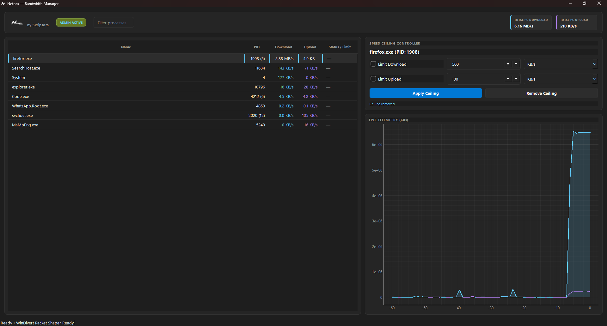
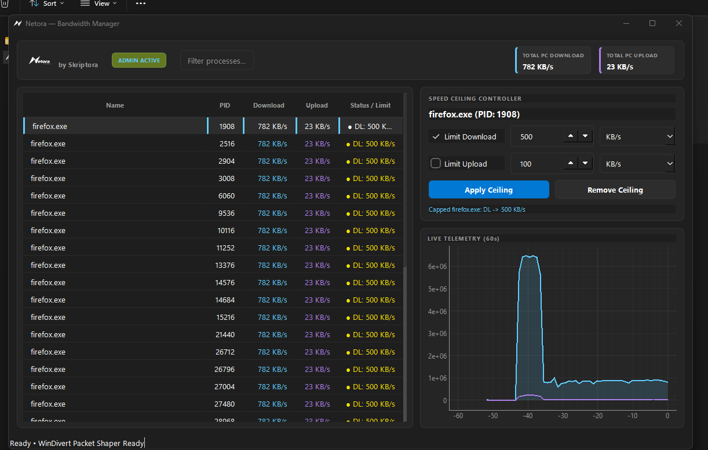
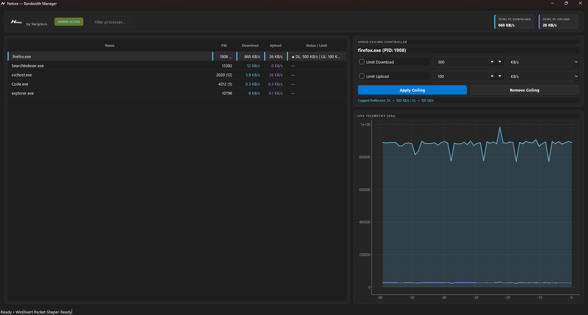

# Netora

> Simple, per-application bandwidth manager and live network monitor for Windows. Built by **Skriptora**.

<!-- IMAGE PLACEHOLDER: Main Netora window running with dark theme, showing the process list and telemetry graph -->

---

## Quick Start (No Python Required)

1. Go to the [Releases](https://github.com/mohdsha06/NETORA-Bandwidth-Manager/releases) tab.
2. Download the latest `Netora-v1.0.0-win64.zip`.
3. Extract the `.zip` anywhere on your PC.
4. Double-click **`Netora.exe`** and accept the Windows UAC prompt (**Yes**) to grant driver privileges.

---

## How to Set a Speed Limit

### Step 1: Select a Process
Click on any application in the list (e.g., `firefox.exe` or `curl.exe`). Multi-process apps like browsers are automatically grouped into a single row.

<!-- IMAGE PLACEHOLDER: Close-up screenshot of the process table with a process row (like firefox.exe) selected/highlighted -->

### Step 2: Configure Speed Ceilings
On the right panel under **Speed Ceiling Controller**:
- Check **Limit Download**, enter your target speed, and choose your unit (`KB/s` or `MB/s`).
- Check **Limit Upload** if you also want an upstream cap.

<!-- IMAGE PLACEHOLDER: Close-up of the Speed Ceiling Controller panel showing checkboxes ticked with values entered (e.g., 500 KB/s) -->

### Step 3: Apply the Ceiling
Click **Apply Ceiling**. The status column updates immediately, and live bandwidth is held to your limit. 

<!-- IMAGE PLACEHOLDER: Telemetry graph showing bandwidth dropping and clamping cleanly after applying the ceiling -->

To remove a limit, select the process and click **Remove Ceiling**.

---

## License

MIT License © Skriptora. WinDivert is licensed under LGPL v3.
